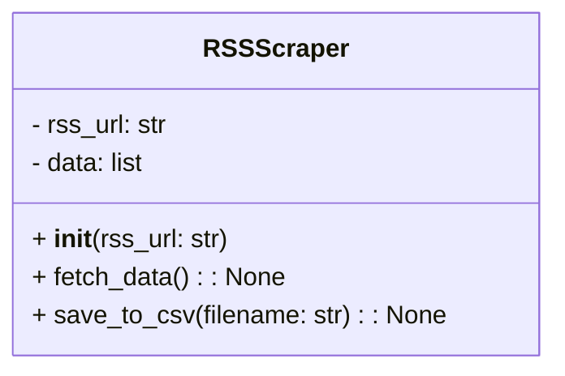

# クラス図

```mermaid
classDiagram
    class RSSScraper {
        - rss_url: str
        - data: list
        + __init__(rss_url: str)
        + fetch_data() : None
        + save_to_csv(filename: str) : None
    }

```
