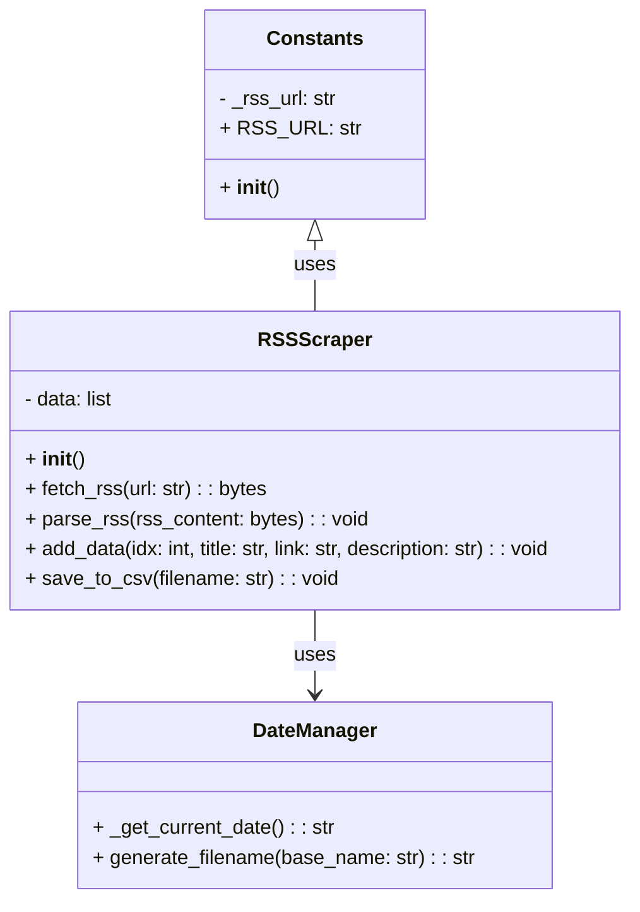

# クラス図

```mermaid
classDiagram
    class Constants {
        - _rss_url: str
        + __init__()
        + RSS_URL: str
    }

    class RSSScraper {
        - data: list
        + __init__()
        + fetch_rss(url: str): bytes
        + parse_rss(rss_content: bytes): void
        + add_data(idx: int, title: str, link: str, description: str): void
        + save_to_csv(filename: str): void
    }

    class DateManager {
        + _get_current_date(): str
        + generate_filename(base_name: str): str
    }

    Constants <|-- RSSScraper : uses
    RSSScraper --> DateManager : uses
```
